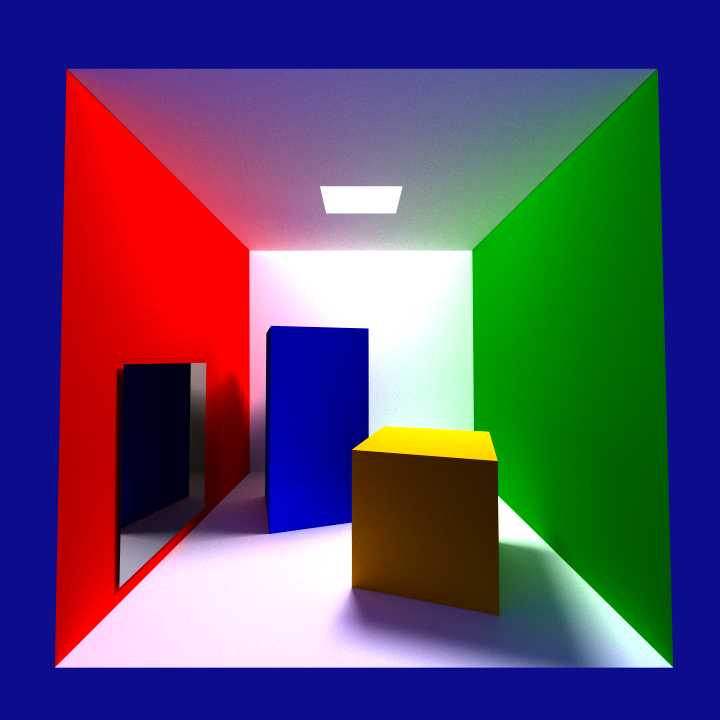

# VTR-2324

Repositório destinado a guardar o trabalho realizado na cadeira de Visualização em Tempo Real no ano letivo 2023/2024.

## Grupo
| Número   | Nome                                                        |
| -------- | ----------------------------------------------------------- |
| PG53879  | [Inês Ferreira](https://github.com/inesferreira18)          |
| PG53951  | [João Braga](https://github.com/LykiFyar)                   |
| PG54084  | [Marta Sá](https://github.com/findingmarta)                 |

## Outputs

### Clamp Tone Mapping

### Reinhard Tone Mapping

### ACES Tone Mapping

Nota Final: 15
